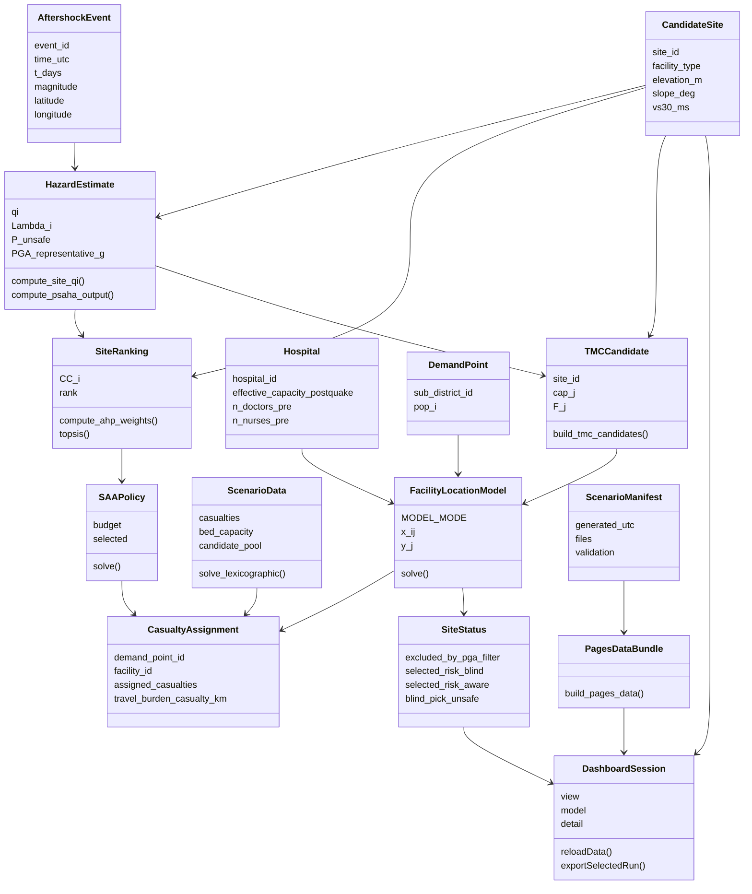
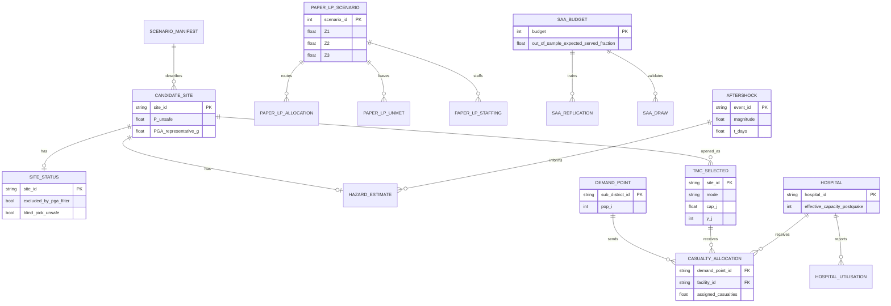
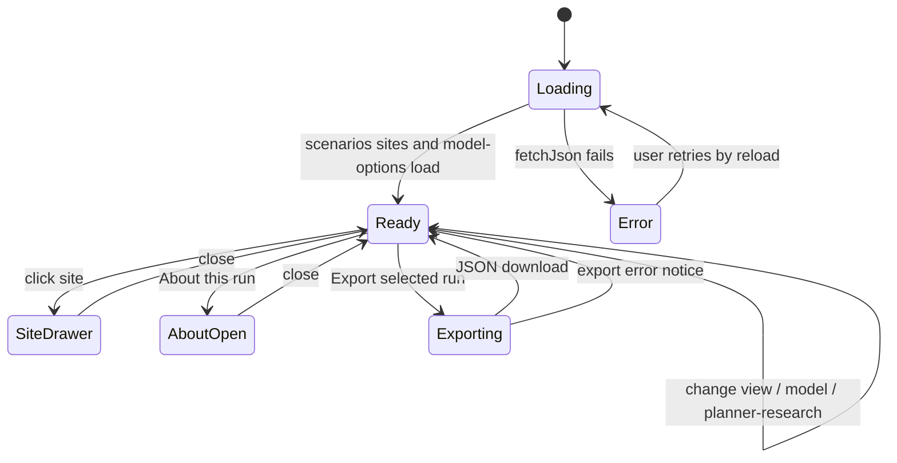
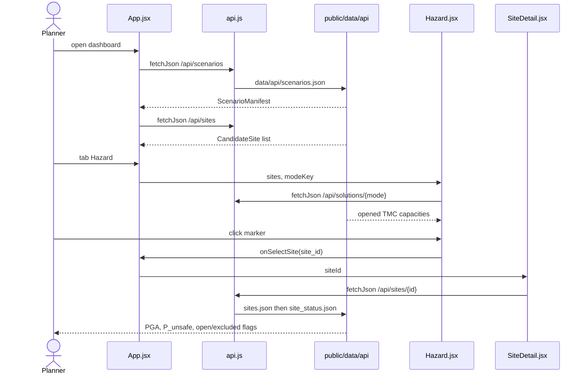
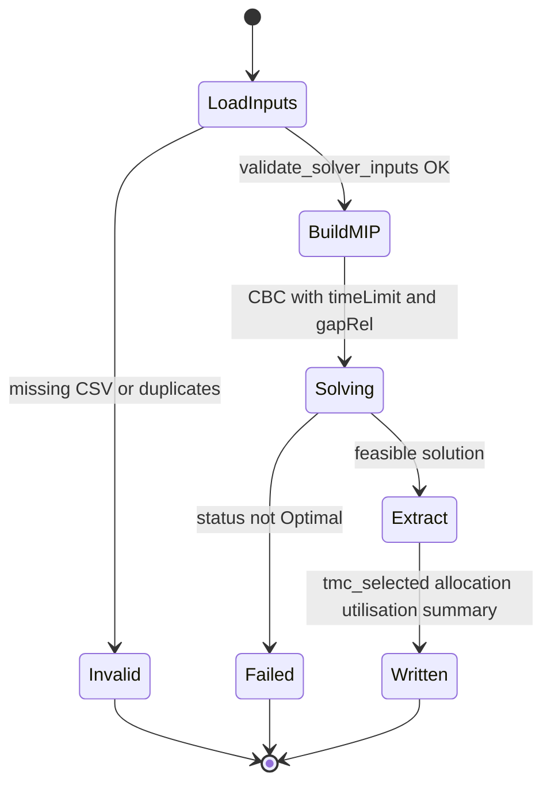
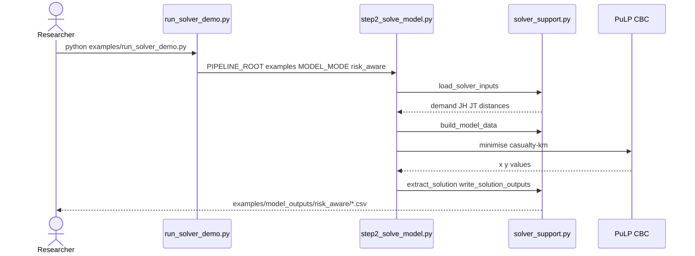
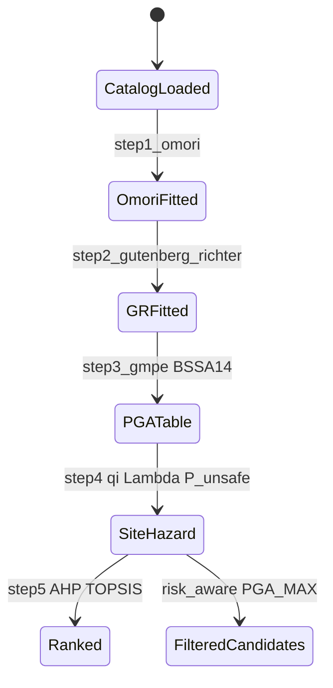
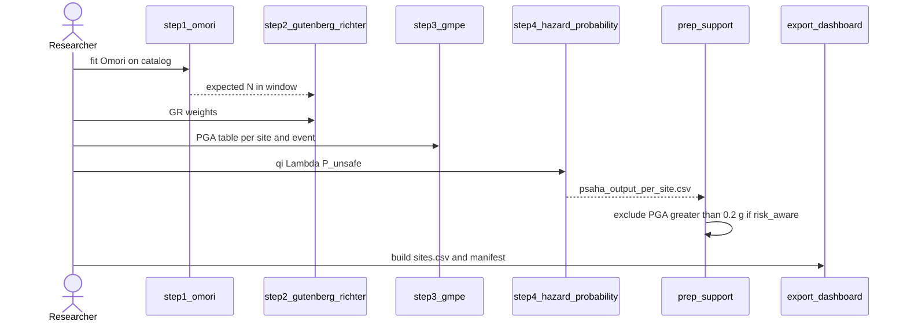
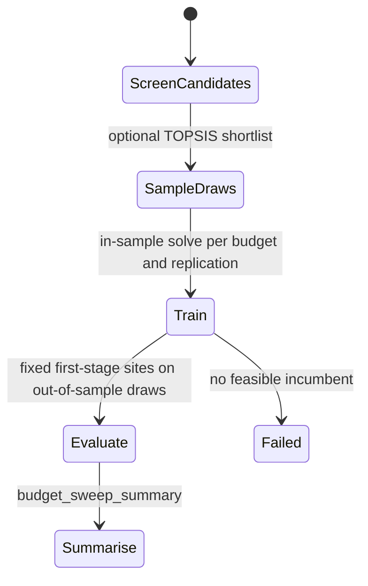
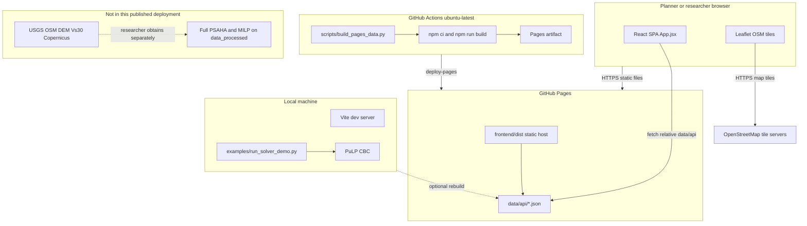

# Component-Level Design

> **Implementation status:** For the current run order, available reference profiles, and current limitations, see [CURRENT_PIPELINE.md](CURRENT_PIPELINE.md). Sections below describe the architecture; older gap notes have been reconciled with the current exporter and bundle.

**Project:** AARO — Aftershock Aware Response Optimizer  
**Repository:** `aftershock_aware_reponse_optimizer`  
**Document:** Software Design, Part 1

This document describes the design of the published AARO system from the code in this repository. Domain classes are used even where the implementation is procedural (pandas DataFrames and scripts). Each class is mapped to the modules that actually implement it. Nothing is invented: if a class has no object-oriented type in Python or React, that is stated.

---

## 1. Design classes

The problem domain is post-earthquake casualty response: aftershocks, candidate sites, hospitals, demand at sub-districts, hazard at each site, ranking, facility opening, casualty routing, and a planner-facing dashboard.

### 1.1 AftershockEvent

| | |
|---|---|
| **Responsibilities** | Represent one recorded aftershock used to fit temporal decay and spatial ground-motion scenarios. |
| **Key attributes** | `event_id`, `time_utc`, `t_days`, `latitude`, `longitude`, `depth_km`, `magnitude` |
| **Key methods** | `load_and_convert_times` (elapsed days since mainshock) |
| **Collaborators** | `OmoriModel`, `GutenbergRichterModel`, `GroundMotionModel` |
| **Implemented in** | `pipelines/psaha/step1_omori.py`; catalog file `examples/reference_results/aftershocks.csv` |

There is no Python class named `AftershockEvent`. Rows of the catalog DataFrame play this role.

### 1.2 CandidateSite

| | |
|---|---|
| **Responsibilities** | Represent an OSM-derived location that may become a Temporary Medical Centre (TMC). Hold terrain, access, soil, and optional damage attributes. |
| **Key attributes** | `site_id`, `osm_id`, `name`, `latitude`, `longitude`, `facility_type`, `elevation_m`, `slope_deg`, `dist_to_road_m`, `vs30_ms`, `soil_class`, `resolution_tier` |
| **Key methods** | Built by extraction (`extract_02` … `extract_06`) and assembled in `export_dashboard.build_sites_table` |
| **Collaborators** | `HazardEstimate`, `SiteRanking`, `TMCCandidate`, `SiteStatus` |
| **Implemented in** | `pipelines/extraction/export_dashboard.py` (`build_sites_table`); `examples/reference_results/sites.csv`; dashboard `frontend/src/views/Hazard.jsx`, `SiteDetail.jsx` |

### 1.3 Hospital

| | |
|---|---|
| **Responsibilities** | Represent an existing hospital with curated capacity and staffing. Closed facilities (`effective_capacity_postquake = 0`) cannot receive casualties. |
| **Key attributes** | `hospital_id`, `hospital_name`, `latitude`, `longitude`, `bed_capacity_total`, `effective_capacity_postquake`, `n_doctors_pre`, `n_nurses_pre`, `capacity_confidence`, `capacity_source` |
| **Key methods** | `HospitalDataValidator.validate`; `build_hospitals_jh`; `find_nearest_osm_hospital` |
| **Collaborators** | `DemandPoint`, `CasualtyAssignment`, `HospitalDataValidator` |
| **Implemented in** | `pipelines/data_prep/validate_hospital_data.py` (`class HospitalDataValidator`); `pipelines/deterministic_current/prep_support.py`; `examples/reference_results/hospitals.csv` |

`HospitalDataValidator` is one of the few real Python classes in the pipeline.

### 1.4 DemandPoint

| | |
|---|---|
| **Responsibilities** | Place casualty demand at a sub-district centroid and require full allocation in the deterministic model. |
| **Key attributes** | `sub_district_id`, `name`, `latitude`, `longitude`, `population`, `pop_i` (casualty demand) |
| **Key methods** | `build_demand_points`, `add_demand_coordinates` |
| **Collaborators** | `CasualtyAssignment`, `DistanceRecord` |
| **Implemented in** | `pipelines/deterministic_current/prep_support.py`; `examples/reference_results/demand_points.csv` |

### 1.5 OmoriModel / GutenbergRichterModel / GroundMotionModel / HazardEstimate

These four classes form the PSAHA (Probabilistic Seismic Aftershock Hazard Analysis) chain.

| Class | Responsibilities | Key attributes / methods | Implemented in |
|---|---|---|---|
| **OmoriModel** | Fit modified Omori decay \(n(t)=K/(t+c)^p\) by MLE | `K`, `c`, `p`; `fit_omori_mle`, `expected_aftershock_count` | `pipelines/psaha/step1_omori.py` |
| **GutenbergRichterModel** | Fit magnitude-frequency weights | `fit_gutenberg_richter`; magnitude bins and weights | `pipelines/psaha/step2_gutenberg_richter.py` |
| **GroundMotionModel** | Median PGA and sigma at a site for a scenario | `compute_pga_bssa14` (BSSA14), `haversine_distance` | `pipelines/psaha/step3_gmpe.py` |
| **HazardEstimate** | Per-site \(q_i\), \(\Lambda_i\), \(P_{\text{unsafe}}\), representative PGA | `qi`, `Lambda_i`, `P_unsafe`, `PGA_representative_g`; `compute_site_qi`, `compute_psaha_output` | `pipelines/psaha/step4_hazard_probability.py` |

**Collaborators:** `AftershockEvent`, `CandidateSite`. Threshold \(g^*=0.2\) g matches `PGA_MAX` in `pipelines/deterministic_current/settings.py`.

### 1.6 SiteRanking

| | |
|---|---|
| **Responsibilities** | Rank risk-aware TMC candidates with AHP weights and TOPSIS closeness \(CC_i\). Advisory only; not the deterministic opening rule. |
| **Key attributes** | `site_id`, `pga_g`, `slope_deg`, `elevation_m`, `dist_to_road_m`, `CC_i`, `rank`, `D_plus`, `D_minus` |
| **Key methods** | `compute_ahp_weights`, `build_decision_matrix`, `topsis` |
| **Collaborators** | `CandidateSite`, `HazardEstimate`, `SAAPolicy` (candidate screening in the stochastic pipeline) |
| **Implemented in** | `pipelines/psaha/step5_ahp_topsis.py` |

The published `sites.csv` snapshot does not currently include `CC_i` or `rank` (see Gaps).

### 1.7 TMCCandidate

| | |
|---|---|
| **Responsibilities** | A site that may be opened as a TMC: capacity, opening penalty, and optional PGA filter. |
| **Key attributes** | `site_id`, `cap_j`, `F_j` (opening penalty in casualty-km), `facility_type`, `set` (= `JT`) |
| **Key methods** | `build_tmc_candidates`, `assign_opening_penalty` |
| **Collaborators** | `CandidateSite`, `HazardEstimate`, `FacilityLocationModel` |
| **Implemented in** | `prep_support.build_tmc_candidates`; written to `model_inputs/<mode>/candidates_jt.csv` |

Capacity is \( \mathrm{clip}(\mathrm{site\_area\_m2}/30, TMC\_MIN, TMC\_MAX) \) when area is present; otherwise a type fallback. Risk-aware mode drops sites with PGA \(> 0.2\) g.

### 1.8 DistanceRecord

| | |
|---|---|
| **Responsibilities** | Store travel distance from a demand point to a hospital or TMC. |
| **Key attributes** | `demand_point`, `facility`, `distance_km` |
| **Key methods** | `build_distance_matrix`, `haversine_km` |
| **Collaborators** | `DemandPoint`, `Hospital`, `TMCCandidate` |
| **Implemented in** | `prep_support.build_distance_matrix`; `examples/model_inputs/risk_aware/distance_matrix.csv` |

### 1.9 FacilityLocationModel

| | |
|---|---|
| **Responsibilities** | Decide which TMCs to open (`y_j`) and how many casualties to send (`x_{ij}`). Minimise travel burden plus opening penalty, in casualty-kilometres. |
| **Key attributes** | Decision variables `x[(i,j)]` continuous, `y[j]` binary; `C_TRANS`, `MIP_GAP`, `TIME_LIMIT_SEC`, `MODEL_MODE` |
| **Key methods** | `load_solver_inputs`, `build_model_data`, `extract_solution`, `write_solution_outputs` |
| **Collaborators** | `DemandPoint`, `Hospital`, `TMCCandidate`, `DistanceRecord`, `CasualtyAssignment`, `SitingPlan` |
| **Implemented in** | `pipelines/deterministic_current/step2_solve_model.py`, `solver_support.py`, `settings.py`; demo entry `examples/run_solver_demo.py` |

This is a PuLP mixed-integer linear program (CBC), not a Python class.

### 1.10 CasualtyAssignment and SitingPlan

| Class | Responsibilities | Key attributes | Implemented in |
|---|---|---|---|
| **CasualtyAssignment** | One positive flow from demand to a facility | `demand_point_id`, `facility_id`, `facility_set` (`JH`/`JT`), `assigned_casualties`, `distance_km`, `travel_burden_casualty_km` | `solver_support.extract_solution`; `casualty_allocation.csv` |
| **SitingPlan** | Opened TMCs and hospital use for one solver mode | `y_j`, `assigned_casualties`, `utilisation_pct` | `tmc_selected.csv`, `hospital_utilisation.csv` |
| **SiteStatus** | Per-site comparison of risk-blind vs risk-aware | `candidate_risk_blind`, `candidate_risk_aware`, `excluded_by_pga_filter`, `selected_risk_blind`, `selected_risk_aware`, `blind_pick_unsafe` | `export_dashboard.build_site_status`; `site_status.csv` |

### 1.11 ScenarioData and MedicalResponseModel

| | |
|---|---|
| **Responsibilities** | Scenario-wise lexicographic LP: unmet demand (Z1), then travel (Z2), then extra staff (Z3). Triage T1–T3, periods, hospital damage, T1 distance rule. |
| **Key attributes** | `demand_ids`, `hospitals`, `tmcs`, `distance`, `casualties`, `probabilities`, `road_damage`, `damage`, `bed_capacity`, `outpatient_capacity`, `doctors`, `nurses`, `candidate_pool` |
| **Key methods** | `load_scenario_data`, `eligible_t1_pairs`, `build_scenario_lp`, `solve_lexicographic`, `extract_solution` |
| **Collaborators** | `DemandPoint`, `Hospital`, `TMCCandidate`, `StaffingAssignment` |
| **Implemented in** | `pipelines/stochastic_medical/scenario_lp_support.py` (`@dataclass ScenarioData`); `run_scenario_lp.py` |

### 1.12 SAAPolicy

| | |
|---|---|
| **Responsibilities** | Two-stage sample average approximation: first-stage shared TMC openings under a site-count budget; second-stage routing and staffing on sampled draws. Compare in-sample vs out-of-sample service. |
| **Key attributes** | `budget`, `selected` site set, served fraction, unmet, objective components `Zunmet`, `Ztravel`, `Zstaff` |
| **Key methods** | `make_draw`, `solve`, `fraction_served` |
| **Collaborators** | `ScenarioData`, `SiteRanking` (optional TOPSIS screening), `CasualtyAssignment` |
| **Implemented in** | `pipelines/stochastic_medical/run_saa.py`, `solver_support.py` |

### 1.13 ScenarioManifest and PagesDataBundle

| Class | Responsibilities | Key attributes / methods | Implemented in |
|---|---|---|---|
| **ScenarioManifest** | Describe the study window, PGA threshold, file inventory, and validation status for the dashboard | `generated_utc`, `scenarios[]`, `files`, `validation`, `data_source` | `export_dashboard.py`; `examples/reference_results/scenario_manifest.json` |
| **PagesDataBundle** | Convert the CSV/JSON snapshot into static JSON files that mimic `/api/...` paths | `records`, `write_json`, `export_profile`, `main` | `scripts/build_pages_data.py` → `frontend/public/data/api/` |

### 1.14 DashboardSession

| | |
|---|---|
| **Responsibilities** | Planner/researcher UI: select view and model, load frozen results, open site detail, export a JSON bundle. |
| **Key attributes** | `view`, `model`, `detail` (`planner`/`research`), `manifest`, `sites`, `detailSiteId`, `error` |
| **Key methods** | `reloadData`, `exportSelectedRun`, `openDetail`, `setView`, `setModel`, `setDetail` |
| **Collaborators** | `CandidateSite`, `SitingPlan`, `ScenarioManifest`, `SiteRanking` (when ranks exist) |
| **Implemented in** | `frontend/src/App.jsx`, `useUrlState.js`, `api.js` |

Views are React function components, not classes: `Briefing`, `Hazard`, `AllocationMap`, `Compare`, `StochasticSiting`, `PaperLPResults`, `SAAMedicalResponse`, `SAAResults`, `ProfileComparison`, `ResearchLab`, `SiteDetail`, `AboutRun`.

### 1.15 Class diagram

---

## 2. Persistent data

The pipeline source of truth is files: CSV, JSON, and (for the full research run, not shipped here) rasters and caches. An optional local SQLite catalog is also provided for the curated reference snapshot; it is rebuildable, is not used by the browser or solvers, and is not the source of truth.

### 2.1 Data stores in this repository

| Store | Purpose |
|---|---|
| `examples/reference_results/` | Frozen Kahramanmaraş result snapshot used by the public dashboard |
| `frontend/public/data/api/` | Static JSON generated by `scripts/build_pages_data.py` (git-built locally / CI) |
| `data_etl/earthquake_response.db` | Optional ignored SQLite projection of the reference CSVs; generated by `scripts/init_db.py` |
| `examples/model_inputs/risk_aware/` | Tiny synthetic solver inputs |
| `examples/model_outputs/risk_aware/` | Output of `examples/run_solver_demo.py` |
| Full pipeline dirs (`data_raw/`, `data_processed/`, `model_inputs/`, `model_outputs/`, `outputs_psaha/`, `outputs_stochastic/`, `dashboard_data/`) | Used when the complete pipeline is run locally with external inputs; **not** included in the public snapshot (see `docs/full-pipeline-inputs.md`) |

### 2.2 Published result files (keys and relationships)

Primary key is shown first. Relationships are logical (CSV joins), not SQL foreign keys.

| File | Fields (from the snapshot) | Keys / relationships | Mapped classes |
|---|---|---|---|
| `sites.csv` | `site_id`, OSM fields, terrain, Vs30, `qi`, `Lambda_i`, `P_unsafe`, `PGA_representative_g`, damage fields, `resolution_tier` | PK `site_id`. Joins to `site_status`, TMC selections | `CandidateSite`, `HazardEstimate` |
| `site_status.csv` | candidate/selected flags per mode, `excluded_by_pga_filter`, `blind_pick_unsafe` | PK `site_id` → `sites` | `SiteStatus` |
| `hospitals.csv` | ids, coordinates, bed and staff fields, provenance | PK `hospital_id` | `Hospital` |
| `demand_points.csv` | `sub_district_id`, name, coords, `population`, `pop_i` | PK `sub_district_id` | `DemandPoint` |
| `aftershocks.csv` | USGS-style catalog plus `t_days` | PK `event_id` | `AftershockEvent` |
| `scenario_manifest.json` | scenario metadata, `files` inventory, `validation` | Document root | `ScenarioManifest` |
| `<mode>/tmc_selected.csv` | `site_id`, `cap_j`, `F_j`, `y_j`, assignment, utilisation | PK `site_id` → `sites`; `mode` ∈ {`risk_blind`,`risk_aware`} | `SitingPlan` |
| `<mode>/casualty_allocation.csv` | demand, facility, set JH/JT, flow, distance, travel burden | FK `demand_point_id`, `facility_id` | `CasualtyAssignment` |
| `<mode>/hospital_utilisation.csv` | `site_id`, `hospital_id`, capacity, assigned, utilisation | FK hospital / site | `Hospital` + assignment |
| `paper_lp/scenario_results.csv` | `scenario_id`, `scenario_prob`, Z1–Z3, served/unmet, TMC/staff counts | PK `scenario_id` | `ScenarioData` results |
| `paper_lp/casualty_allocation.csv` | scenario, demand, facility, triage, period, flow, distance | composite key | medical `CasualtyAssignment` |
| `paper_lp/unmet_by_triage.csv` | scenario, demand, triage, period, unmet | composite key | `ScenarioData` |
| `paper_lp/staffing_plan.csv` | scenario, facility, `staff_type`, period, `extra_staff` | composite key | staffing |
| `paper_lp/sensitivity_summary.csv` | one-at-a-time parameter sweep rows | parameter + level | robustness |
| `saa/budget_sweep_summary.csv` | budget, in/out-of-sample served and unmet, SDs, replications | PK `budget` | `SAAPolicy` |
| `saa/budget_sweep_in_sample_by_replication.csv` | per-replication in-sample metrics | budget + replication | `SAAPolicy` |
| `saa/budget_sweep_out_of_sample_by_draw.csv` | per-draw out-of-sample metrics | budget + draw | `SAAPolicy` |
| `saa/run_metadata.json` | run settings (replications, draws, budgets) | document | `SAAPolicy` |

Synthetic solver inputs:

| File | Fields | Keys |
|---|---|---|
| `examples/model_inputs/risk_aware/demand_points.csv` | `sub_district_id`, `name`, coords, `pop_i` | PK `sub_district_id` |
| `hospitals_jh.csv` | `site_id`, `cap_j`, … | PK `site_id` |
| `candidates_jt.csv` | `site_id`, `cap_j`, `F_j`, type, name, coords | PK `site_id` |
| `distance_matrix.csv` | `demand_point`, `facility`, `distance_km` | composite PK |

### 2.3 ER diagram (file entities)

### 2.4 Class-to-store map (dashboard path)

`PagesDataBundle` copies the snapshot into JSON:

- `sites.json`, `site_status.json`, `hospitals.json`, `demand_points.json`, `scenarios.json`, `model-options.json`
- `solutions/risk_blind.json`, `solutions/risk_aware.json`
- `paper_lp/all_candidates.json` (from `paper_lp/` files via the fallback in `profile_source`)
- `saa/all_candidates.json` (from `saa/` files via the same fallback)

`frontend/src/api.js` maps `/api/...` fetch paths onto those JSON files. There is no live FastAPI process in this repository.

---

## 3. Behavioural representation

The four components that drive the main flows are `DashboardSession`, `FacilityLocationModel`, `HazardEstimate`, and `SAAPolicy`.

### 3.1 DashboardSession — state diagram

The published app has no dataset-chooser or upload stage. `App` loads the reference bundle on mount.

**Flow.** `reloadData` calls `fetchJson('/api/scenarios')`, `/api/sites`, and `/api/model-options`. Tab buttons set `view`. Model buttons set `model` only if `available` is true. URL state (`useUrlState`) stores `view`, `mode`, `model`, and `detail` so the page is deep-linkable. Site clicks set `detailSiteId` and `SiteDetail` loads `/api/sites/{id}`.

### 3.2 DashboardSession — sequence (planner inspects hazard and a site)

### 3.3 FacilityLocationModel — state diagram

**Flow.** `examples/run_solver_demo.py` sets `PIPELINE_ROOT=examples` and `MODEL_MODE=risk_aware`, then runs `step2_solve_model.py`. The MIP requires full demand allocation, hospital capacity, and TMC capacity only if `y_j=1`. Objective = \(\sum C_{TRANS}\, d_{ij}\, x_{ij} + \sum F_j y_j\).

### 3.4 FacilityLocationModel — sequence (synthetic demo)

### 3.5 HazardEstimate — state diagram

Step 5 is parallel to the MILP: ranking does not set `y_j`. Risk-aware filtering is in `build_tmc_candidates`.

### 3.6 HazardEstimate — sequence (full pipeline, local inputs required)

The public GitHub Pages site does not run this sequence. It only displays a previously exported snapshot.

### 3.7 SAAPolicy — state diagram

The current reference snapshot contains a completed all-candidates SAA sweep plus one detailed policy export. `scripts/build_pages_data.py` includes those detail rows in `saa/all_candidates.json`, and the static API maps the SAA detail route to that JSON. A complete TOPSIS-screened SAA profile is not present, so that choice remains unavailable. See [CURRENT_PIPELINE.md](CURRENT_PIPELINE.md) for the current profile inventory.

---

## 4. Deployment diagram

**Hosting / deployment (from `docs/publishing.md` and `.github/workflows/pages.yml`).**

- The public product is a **static** site. GitHub Actions on `main` (paths: `frontend/**`, `examples/reference_results/**`, `scripts/build_pages_data.py`) runs Python 3.11 + pandas, Node 20, `npm ci`, `npm run build`, and `actions/deploy-pages`.
- `frontend/vite.config.js` sets `base: './'` so assets work on a project Pages URL.
- The dashboard does **not** accept uploads and does **not** run models on Pages.
- Local UI: `cd frontend && npm ci && npm run dev`.
- Local solver demo: `python examples/run_solver_demo.py` (needs `requirements-demo.txt`).
- External services at runtime: OSM map tiles only. USGS/Overpass/DEM APIs are used only if the full extraction pipeline is run with private inputs.
- No application database, no authentication, no FastAPI process in the published architecture.

---

## 5. Refactoring and alternatives

### 5.1 Research pipeline (PSAHA + prep + solvers)

**Original design.** Numbered one-off scripts and a monolithic facility-location file (still under `archive/`). Settings and paths were mixed into scripts. TMC capacity was a flat per-type guess. Ground motion used an unpublished attenuation formula. Opening “cost” was an unlabeled constant.

**Alternative considered.** (1) Keep TOPSIS scores inside the MILP opening penalty. (2) Price transport in currency (fuel). Both were rejected in comments in `prep_support.assign_opening_penalty` and `settings.py`: TOPSIS is a separate ranking deliverable; currency would add unverifiable prices without changing the MILP ratio structure.

**Refactoring applied.** Logic split into `prep_support.py` / `solver_support.py` with thin `step1`/`step2` entry points. Dual `MODEL_MODE` trees. Area-derived capacity. BSSA14 GMPE. Objective documented as casualty-km. AHP/TOPSIS restored as `step5_ahp_topsis.py` without driving `y_j`.

**Code smells still present.**

- **God scripts / missing types.** Domain objects are DataFrames. Only `ScenarioData` and `HospitalDataValidator` are types. Recommended: extract small dataclasses (`DemandPoint`, `TMCCandidate`) without changing solver math.
- **Import-time configuration.** `settings.py` reads `MODEL_MODE` at import (`pipelines/deterministic_current/settings.py` lines 15–18). That forces `run_both_modes.py` and the demo to use subprocesses. Alternative: pass mode into functions.
- **Duplicated `haversine_km`.** Same helper in `prep_support.py` (deterministic), `pipelines/stochastic_medical/prep_support.py`, `step3_gmpe.py`, and hospital extraction. Extract a shared geo module.
- **Stale comment vs code.** `assign_opening_penalty` still says `topsis_ranking.csv` is never produced (lines 292–298), but `step5_ahp_topsis.py` now writes it. Update the comment so design docs and code agree.
- **`sys.exit` on validation.** `solver_support.load_input_csv` terminates the process. Alternative: raise exceptions so tests and a future API can handle errors.

### 5.2 Medical models (Paper LP and SAA)

**Original design.** Archived AUGMECON2 / step6 placeholders (`archive/stochastic_medical_partial/`).

**Alternative considered.** One multi-objective model for both ranking and routing. The current split keeps scenario-wise Paper LP independent of SAA first-stage openings.

**Refactoring applied.** `ScenarioData` dataclass; lexicographic LP in `scenario_lp_support.py`; SAA in `run_saa.py` with budget and out-of-sample draws.

**Code smells.** Large `run_saa.solve` (status handling, objective checks, metrics in one function). Duplicate distance/capacity construction vs the deterministic prep. Recommended: extract a `SolveResult` type and share network loading.

### 5.3 Dashboard (React static adapter)

**Original design.** A sibling FastAPI app served `dashboard_data/` live, including ZIP upload and `run_demo_job.py`. This publish repo **removed the backend** and kept the same `/api/...` client paths.

**Alternative considered.** Keep FastAPI on a hosted server so researchers can upload new regions. Trade-off: hosting, secrets, job isolation, and no auth in the old API (`allow_origins=["*"]`). Static Pages is simpler and safer for a public demo.

**Refactoring applied.** `frontend/src/api.js` maps REST-like paths to JSON files. `scripts/build_pages_data.py` is an Adapter from CSV snapshot to that contract. `useUrlState` replaced duplicated tab/mode state and avoided adding `react-router`.

**Code smells.**

- **Leaky API illusion.** Comments and `fetchJson('/api/paper-lp/...')` look like a server. Recommended: rename generated files *or* a thin `DataRepository` module with methods `getSites()`, `getSolution(mode)` so the UI does not speak HTTP paths.
- **Optional SAA profile coverage.** The all-candidates detail route is exported and served from static JSON. The TOPSIS-screened SAA choice remains unavailable until a complete run is added to the reference bundle.

- **`exportSelectedRun` complexity.** Nested conditionals in `App.jsx` (lines 51–87) mix MILP, Paper LP, and SAA. Extract `buildExportBundle(model)`.
- **Magic PGA in the UI.** `Hazard.jsx` hard-codes `PGA_MAX = 0.2` instead of reading `scenario_manifest.json` (`pga_filter_threshold_g`).

### 5.4 Data export

**Original design.** Dashboard would read `model_outputs/` directly.

**Refactoring applied.** Single validated bundle (`export_dashboard.py`) plus manifest `files[].status` so the UI can show missing data instead of inventing it.

**Smell.** `export_dashboard.py` still comments about “the dashboard repo”; this repository now contains the frontend. Update that header. Published `sites.csv` omits TOPSIS columns even though step 5 exists — re-export if ranking must appear on the map.

---

## Gaps / Recommendations

1. **No FastAPI in this repo.** The optional SQLite catalog is only a local projection; pipeline and dashboard persistence remain CSV/JSON, and the public site is static.
2. **Full study inputs are not published.** Extraction, PSAHA, and stochastic solves cannot be reproduced from this clone alone (`docs/full-pipeline-inputs.md`).
3. **No `tests/` tree in this repository.** Correctness tests live in the internal research checkout, not here.
5. **SAA TOPSIS top-120 profile is unavailable.** Its checkpoint is incomplete; complete the screened run and export its required summary files before enabling that dashboard option.
4. **Published site ranking fields are limited.**** Ranking code produces `CC_i` and `rank`, but the current reference `sites.csv` does not include them. Re-export the sites table if those fields should appear in site details.
5. **Upload-and-run researcher workflow** is not in this frontend (`RunDemo` is absent). Researchers run Python locally (`run_solver_demo.py` or the full pipeline with private data).
6. **No authentication, rate limiting, or hosted job queue** — appropriate for static Pages; not an operational multi-user DSS.
7. **Interactive medical dispatch** (edit staffing, override routes) is not implemented; medical views are read-only tables and charts.
8. **Comments and archive code** still describe dropped or sibling-repo designs; clean those when touching the files listed in §5.

---

*End of Part 1. Part 2 (interface design) will follow when requested.*
