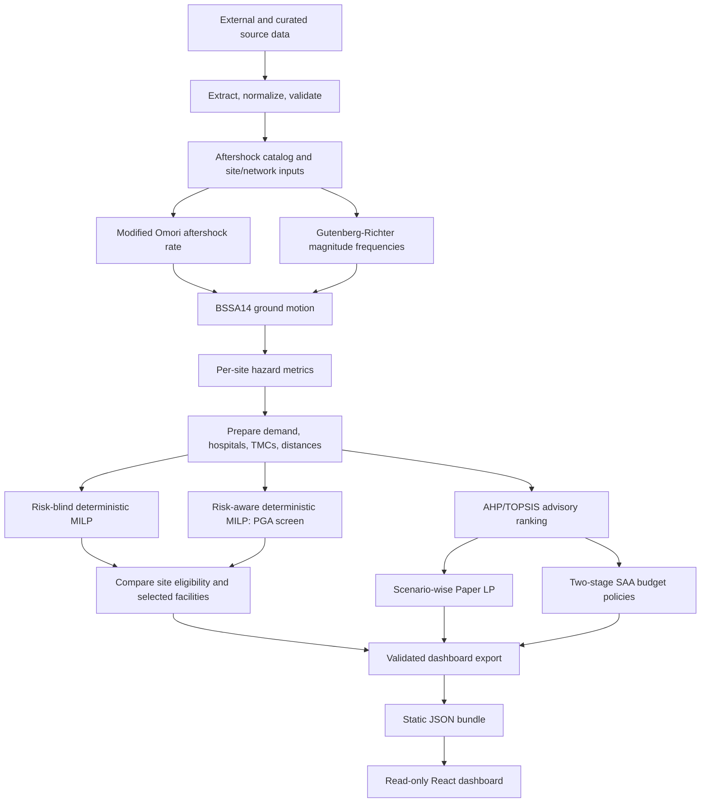

# Current pipeline and published result status

This document describes the pipeline implemented in this repository and the data presently bundled for the dashboard. It is the operational reference for the repo; the component-level design document explains the software mapping in more depth.

## Published repository versus full research run

The repository includes extraction and model scripts, a synthetic deterministic solver fixture, a curated real-case reference bundle, and a React dashboard. It does not include the full raw data, private/curated input workbooks, rasters, geospatial caches, or generated working directories needed to reproduce the entire real-case pipeline from scratch. The Pages site only serves a frozen JSON export; it never launches a solver or extraction job.

The committed dashboard bundle is under `examples/reference_results/`. Static API-shaped JSON is generated at `frontend/public/data/api/` by `scripts/build_pages_data.py`. The frontend loads those local files. Its basemap is an external OpenStreetMap tile service; model results and site data are local static files.

## Method and stage order



### 1. Source data extraction and validation

`pipelines/extraction/config.yaml` defines the study geometry, event window, source paths, and assumptions. `pipelines/extraction/run_extraction.py` dispatches the extractors in `pipelines/data_prep/` and optional validators. Inputs include the USGS event/catalog and PAGER information, OpenStreetMap sites/hospitals/roads, SRTM terrain, Vs30, Copernicus EMSR648 damage layers, curated hospital capacity, sub-districts, and casualty projections.

Extraction outputs are written under `data_processed/` and `outputs_psaha/`. Provider credentials belong in environment variables. The committed reference bundle is already processed and does not include all original sources.

With the inputs in the paths listed in `pipelines/extraction/config.yaml`, a typical extraction and validation pass is:

```bash
python pipelines/extraction/run_extraction.py --list
python pipelines/extraction/run_extraction.py --datasets earthquake_catalog,candidate_sites,slope_by_site,road_network,vs30_by_site,building_damage,hospitals,sub_districts,casualties --validate --report validation_report.html
```

### 2. PSAHA hazard calculations

The implemented sequence is:

1. `pipelines/psaha/step1_omori.py` estimates temporal aftershock decay with a modified Omori model.
2. `step2_gutenberg_richter.py` estimates magnitude-frequency weights.
3. `step3_gmpe.py` applies the BSSA14 ground-motion model to scenario events and candidate sites.
4. `step4_hazard_probability.py` aggregates site hazard measures, including `qi`, `Lambda_i`, `P_unsafe`, and representative PGA.

The run produces the hazard outputs consumed by candidate preparation. The AHP/TOPSIS calculation in `step5_ahp_topsis.py` is a separate ranking product: it does not replace or soften the deterministic risk-aware PGA filter.

Run the four hazard steps in order:

```bash
python pipelines/psaha/step1_omori.py
python pipelines/psaha/step2_gutenberg_richter.py
python pipelines/psaha/step3_gmpe.py
python pipelines/psaha/step4_hazard_probability.py
```

### 3. Deterministic facility location

`pipelines/deterministic_current/run_both_modes.py` launches preparation and solve steps for both modes in subprocesses because `MODEL_MODE` is read when settings are imported.

- **Risk-blind:** all prepared TMC candidates are eligible; no PGA exclusion is applied.
- **Risk-aware:** candidates above the configured PGA threshold (`PGA_MAX`, 0.2 g in the current model settings) are removed before optimization.
- **Optimization:** a PuLP mixed-integer linear program chooses TMC openings and casualty flows to hospitals/TMCs. Its objective is travel burden in casualty-kilometres plus the configured TMC opening penalty. This is a deterministic siting/allocation model, separate from the stochastic medical-response models.

The prep and solve steps write mode-specific inputs and results under `model_inputs/<mode>/` and `model_outputs/<mode>/`. `site_status.csv` compares candidate eligibility and selected locations between the two modes.

```bash
python pipelines/deterministic_current/run_both_modes.py
python pipelines/psaha/step5_ahp_topsis.py
```

### 4. Advisory AHP/TOPSIS ranking

`pipelines/psaha/step5_ahp_topsis.py` ranks risk-aware candidate TMC sites using PGA, slope, elevation, and distance to road, with AHP-derived weights and TOPSIS closeness scores. The ranking is informational and does not choose deterministic MILP openings. The stochastic models can use the all-candidate pool or the TOPSIS top-120 shortlist.

### 5. Stochastic medical-response approaches

These models answer different questions and should not be read as interchangeable results.

- **Paper LP:** `pipelines/stochastic_medical/run_scenario_lp.py` solves a separate continuous lexicographic model for each casualty scenario. It minimizes unmet casualties (Z1), then travel burden (Z2), then additional staffing (Z3). It routes demand to existing hospitals and candidate TMCs; it does not include a first-stage site-opening decision. `--candidate-pool all` and `--candidate-pool topsis` produce comparable all-candidate and TOPSIS-120 profiles.
- **SAA:** `pipelines/stochastic_medical/run_saa.py` selects a TMC policy under a site-count budget using multiple training replications, then evaluates policies on shared out-of-sample draws. It includes recourse allocation and staffing. Model settings record assumptions for casualty multipliers, road damage, hospital capacity loss, staffing productivity, and objective weights. Run `--profile final` for the configured publication-sized sample; choose `--candidate-pool all` or `topsis` to select the candidate pool.
- **Sensitivity:** `run_scenario_lp_sensitivity.py` varies selected Paper LP assumptions. The sensitivity results are additional analyses, not new baseline model profiles.
- **Legacy compatibility:** `run_augmecon2.py` delegates to the SAA entry point; it does not implement the former AUGMECON2 method.

Typical commands, after required inputs and upstream outputs exist:

```bash
python pipelines/stochastic_medical/run_scenario_lp.py --candidate-pool all
python pipelines/stochastic_medical/run_scenario_lp.py --candidate-pool topsis
python pipelines/stochastic_medical/run_saa.py --profile final --candidate-pool all
python pipelines/stochastic_medical/run_saa.py --profile final --candidate-pool topsis
```

### 6. Export and dashboard

After the required extraction and model stages, `pipelines/extraction/export_dashboard.py` assembles a `dashboard_data/` bundle with site, hospital, demand, hazard, status, deterministic, Paper LP, SAA, validation, and provenance records. The command-line wrapper is:

```bash
python pipelines/extraction/run_extraction.py --datasets dashboard_export
```

For the published dashboard, copy/review the intended reference outputs under `examples/reference_results/`, then run `python scripts/build_pages_data.py`. This exporter produces JSON objects used by the React views; it does not run a model. The GitHub Pages workflow then runs `npm ci` and `npm run build` and deploys the static `frontend/dist/` artifact.

The primary research repo `earthquake_response` exports its own CSV handoff under `dashboard_data/`; this showcase does not read that directory directly. When refreshing this showcase from a new primary run, first reconcile its CSVs with the expected filenames and model/profile layout in `examples/reference_results/`, then regenerate the static JSON and review the model availability and metric counts before publishing.

## Current reference-bundle coverage

The bundled case manifest reports 804 site records, 15 hospitals, 369 aftershocks, and 11 demand points. Of the site records, 803 have representative PGA values. The current model availability is recorded in `frontend/public/data/api/model-options.json` and is derived from the reference files by the exporter.

| Dashboard profile | Current status | Notes |
|---|---|---|
| Risk-blind deterministic MILP | Available | Reference result and allocation export present |
| Risk-aware deterministic MILP | Available | Reference result and allocation export present |
| Paper LP, all candidates | Available | 20 scenario rows |
| Paper LP, TOPSIS top 120 | Available | Completed paired profile; 120 of 699 TMC candidates |
| SAA, all candidates | Available | Completed 10-replication run with 1,000 validation draws per policy and detailed policy recourse |
| SAA, TOPSIS top 120 | Unavailable | The available screened SAA checkpoint is incomplete; it is not published as a completed comparison |

The Paper LP allocation CSV identifies hospitals with `JH_...` IDs and TMCs with site IDs. The dashboard counts unique TMC IDs receiving positive flow; the Paper LP has no explicit site-opening variable. The SAA detailed export represents one selected policy and validation draw, not every possible scenario-level route.

### Dashboard presentation and metric definitions

- The landing **Compare plans** table shows risk-blind MILP, risk-aware MILP, and the SAA policy at budget 25. It reports selected TMCs, selected sites above 0.2 g, casualty-weighted mean travel distance, the share of allocated casualties travelling more than 30 km, and untreated T1. Counts are derived from the selected sites, `site_status`, allocations, and profile exports rather than typed into the view.
- The current deterministic comparison is 377 selected / 26 above 0.2 g for risk-blind and 387 selected / 0 above 0.2 g for risk-aware. `site_status.csv` records 26 unsafe risk-blind picks swapped out; the separate 34-candidate exclusion count is the safety filter's effect on TMC eligibility.
- The hazard map's headline is the all-site PGA count: 38 of 803 known values exceed 0.2 g. This differs from the 34 TMC candidates filtered because four of the 38 are hospital-type locations outside the TMC candidate pool. Its marker colors use quantile bands of representative PGA to show the observed distribution; P(unsafe) remains secondary.
- Deterministic assignments total 117,398 expected casualties. The Paper LP's scenario-weighted demand is about 174,000; the SAA's 25-site policy implies about 122,000 from its expected unmet count and served fraction. These totals are from different model demand assumptions and should not be compared as if they shared a demand vector. The deterministic 377/387 opening counts also depend on the 1,000 casualty-km opening penalty; the bundled sweep ranges from 426 to 274 risk-blind openings and 439 to 284 risk-aware openings over penalties from 100 to 10,000.
- Paper LP expected unmet T1 is about 30,055 (82.7% served). T1 is routed only to hospitals within 12 km, so TMC screening does not change the T1 result. Deterministic MILP does not model triage; SAA's detailed triage export is a single recourse draw and is not shown as a comparable expected T1 measure.
- Average distance and the >30 km share are casualty-weighted using allocated casualties and the exported assignment distances. The SAA export does not provide paired expected travel distances, so those cells remain unavailable rather than using its single detailed draw as an expectation. Its 25-site service gain over the zero-site policy is computed against the 120-site budget from the same sweep; the current run yields about 98.5% of that gain.
- `scripts/build_pages_data.py` creates `display_name`, `display_type`, and allocation display labels for the frontend. Named OSM features keep their names; unnamed sites use a readable type and nearest named demand place, retaining the site ID in parentheses (for example, “Social facility near Afşin (S722)”). Curated hospital names are used, and types such as `social_facility` render as “Social facility.” Raw policy and draw identifiers are not used as visible allocation labels.

The curated reference snapshot is distinct from the full extraction/model workspace. Do not infer that all raw inputs, sensitivities, or candidate-pool variants are present just because their model code exists.

## Optional local SQLite catalog

`scripts/init_db.py` creates `data_etl/earthquake_response.db` from the CSV reference snapshot. The catalog stores CSV rows as JSON with source paths and SHA-256 provenance. It is a local query aid, not a source of truth, pipeline dependency, web backend, or requirement for running the frontend.

## Full-run prerequisites and cautions

See [full pipeline inputs](full-pipeline-inputs.md) for excluded inputs and data acquisition notes. Install `requirements.txt`, acquire and validate the required data, set provider credentials in the environment, and then run the stages in order above. Paper LP uses PuLP's HiGHS backend; `highspy` is included in the requirements. PuLP is constrained below 4 because the deterministic and legacy stochastic scripts use the PuLP 3.x CBC command interface. Some upstream datasets have separate access or redistribution terms. The outputs are research results with modeled assumptions and are not operational medical-dispatch recommendations.
